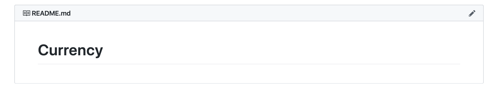
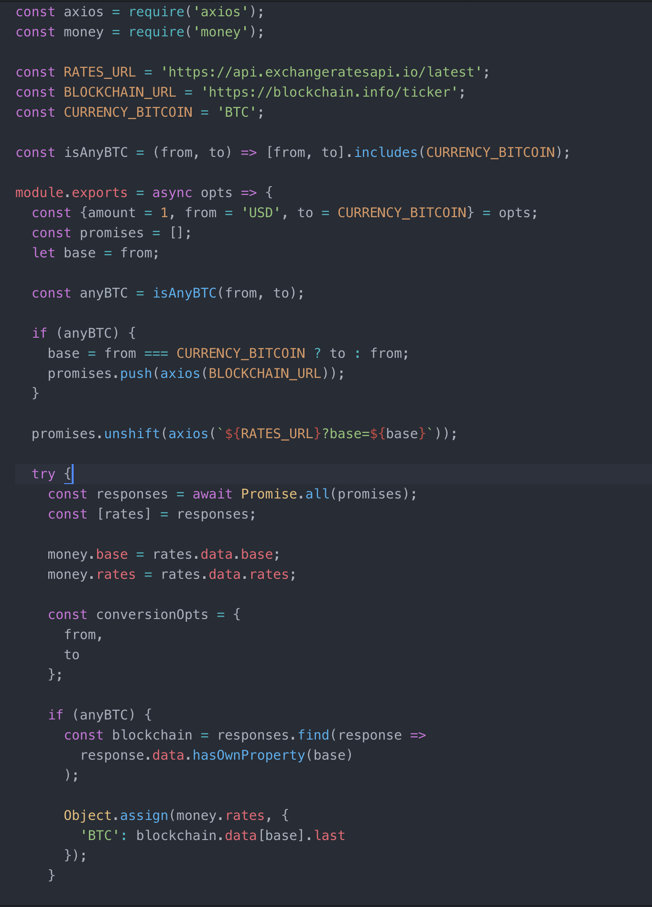
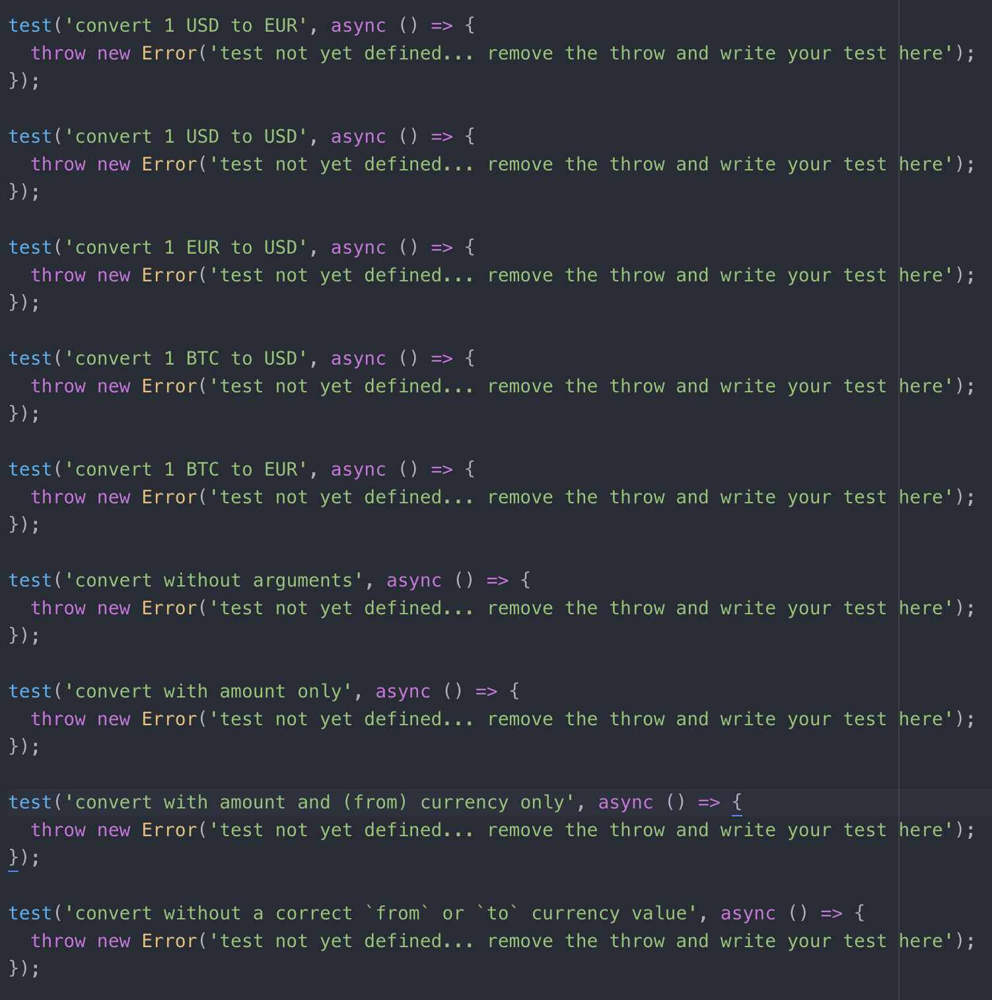

---

Coding isn't just about writing code

---

Driven Development

---

RDD

README-Driven Development

---

CDD

Comments-Driven Development

---

TDD

Test-Driven Development

---

🎯 Write

---

README.md, Comments and Unit Tests

---

🧘

---

🏃‍♀️ Steps to do

---

## [92bondstreet/3-musketeers](https://github.com/92bondstreet/3-musketeers)

---

🛣️ Related course

---

[Course 6 - 3 Musketeers: RDD, CDD and TDD](https://github.com/92bondstreet/javascript-empire#-course-6---3-musketeers-rdd-cdd-and-tdd)

---

👩‍💻 Just tell me what to do

---

* Fork the project via `github`

---

* Clone the project

---

1 directory

---

`currency` directory

---

Understand first the library features

---


Write documentation with README.md

---



---

Write comments

---




---

Write Unit Tests

---




---

```sh
❯ cd /path/to/workspace/3-musketeers/currency
❯ npm i
❯ node cli.js

# chech what's going on
# ...
```

---

```sh
❯ cd /path/to/workspace/3-musketeers/currency
❯ npm run test

# chech what's going on
# ...
```
---

Commit early, commit often, push often
